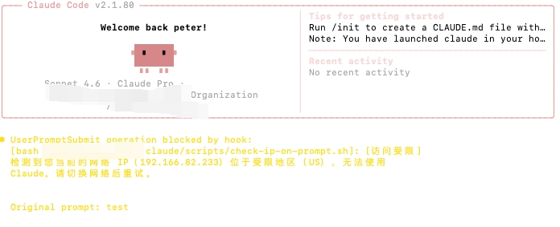

# claude-ip-guard

[English](./README.md) | 中文

基于 IP 地理位置的 Claude Code 访问控制插件。当检测到当前 IP 位于受限国家时，拦截用户输入；当检测到频繁城市切换时，发出分级警告。

## 功能特性

- **国家拦截** — IP 位于受限地区时阻止访问（exit 2，用户可见提示）
- **城市切换检测** — 网络位置发生变化时发出警告，根据近 30 天切换次数分级提示
- **智能缓存** — 每次 prompt 仅做轻量 IP 比对，仅在 IP 变化或超过 10 分钟时触发完整地理查询
- **30 天 IP 历史** — 记录所有 IP 变化的完整地理信息，按 IP 去重
- **Fail-safe** — 接口不可用时一律放行，避免网络故障导致误拦截
- **双接口** — `ipinfo.io`（HTTPS，主）、`ip-api.com`（HTTP，备）
- **共享库** — 核心逻辑集中在 `ip-guard-lib.sh`，两个 hook 脚本共同引用
- **全局或项目安装** — 一条命令安装到单个项目或机器上所有项目

## 禁止国家列表

基于 [Anthropic 官方支持地区](https://www.anthropic.com/supported-countries) 及美国 OFAC 出口管制规定：

| 国家/地区 | ISO 代码 | 原因 |
|-----------|----------|------|
| 中国大陆 | `CN` | 监管/地缘政治 |
| 俄罗斯 | `RU` | 美国制裁 |
| 朝鲜 | `KP` | OFAC 制裁 |
| 伊朗 | `IR` | OFAC 制裁 |
| 叙利亚 | `SY` | OFAC 制裁 |
| 古巴 | `CU` | OFAC 制裁 |
| 白俄罗斯 | `BY` | 制裁相关 |
| 委内瑞拉 | `VE` | 未列入支持名单 |
| 缅甸 | `MM` | 未列入支持名单 |
| 利比亚 | `LY` | 未列入支持名单 |
| 索马里 | `SO` | 未列入支持名单 |
| 也门 | `YE` | 未列入支持名单 |
| 马里 | `ML` | 未列入支持名单 |
| 中非共和国 | `CF` | 未列入支持名单 |
| 南苏丹 | `SS` | 未列入支持名单 |
| 刚果民主共和国 | `CD` | 未列入支持名单 |
| 厄立特里亚 | `ER` | 未列入支持名单 |
| 阿富汗 | `AF` | 未列入支持名单 |
| 乌克兰 | `UA` | 俄占区受限，脚本无法细分省级，整国拦截 |

如需调整，在 `ip-guard-lib.sh` 的 `BLOCKED_COUNTRIES` 变量中增减 ISO 代码即可。

## 工作原理

```
SessionStart（每次会话启动，必检）
└── 读取旧缓存 → 获取上次已通过的城市（old_city）
└── 完整地理查询：ip / country / region / city / org
└── 写入新缓存（供后续 PROMPT hook 复用）
└── 国家在禁止列表？ → exit 2（Claude Code 不展示，不阻断会话*）
└── 城市发生变化？   → exit 2（Claude Code 不展示，不阻断会话*）

    * 真正对用户可见的拦截发生在 UserPromptSubmit（用户发第一条消息时）

UserPromptSubmit（每次用户发送消息前）
└── 轻量查询：仅获取当前公网 IP
    │
    ├── IP 相同 + 缓存未过期（< 10min）
    │   └── 复用缓存 → 禁止名单检查 → 命中则 exit 2（用户可见）
    │
    ├── IP 变化
    │   └── 立即完整地理查询 → 更新缓存
    │   └── 禁止名单 + 城市变化检测 → 触发则 exit 2（用户可见）
    │
    └── IP 相同 + 缓存过期（>= 10min）
        └── 完整地理查询 → 更新缓存
        └── 禁止名单 + 城市变化检测 → 触发则 exit 2（用户可见）
```

> **说明**：Claude Code 不展示 SessionStart hook 的 stderr，且 exit 2 不阻断会话启动。所有对用户可见的拦截均由 UserPromptSubmit hook 完成。

## 城市切换警告

检测到城市变化且该 IP 不在历史中时，触发分级警告（exit 2 阻止当前 prompt，用户重新发送后可继续）：

| 近 30 天切换次数 | 等级 | 提示前缀 |
|----------------|------|---------|
| 第 1 次 | 信息 | `[提示]` |
| 第 2～3 次 | 注意 | `[注意]` |
| 第 4～6 次 | 警告 | `[警告]` |
| 第 7 次及以上 | 严重 | `[严重警告]` |

每次警告附带近 30 天 IP 历史记录表格。

## 环境要求

- `bash`
- `curl`
- `python3`

支持平台：macOS、Linux、WSL。不支持纯 Windows（CMD/PowerShell）。

## 安装方式

### 全局安装（对本机所有项目生效）

```bash
git clone https://github.com/your-username/claude-ip-guard.git
bash claude-ip-guard/install.sh --global
```

脚本安装至 `~/.claude/scripts/`，hook 命令使用绝对路径。

### 项目级安装（仅对指定项目生效）

```bash
# 安装到指定项目
bash claude-ip-guard/install.sh /path/to/your/project

# 安装到当前目录
bash claude-ip-guard/install.sh
```

脚本安装至 `.claude/scripts/`，hook 命令使用相对路径。

安装脚本会自动：
1. 复制 `ip-guard-lib.sh`、`check-ip-on-start.sh`、`check-ip-on-prompt.sh` 到目标目录
2. 按安装模式生成对应路径的 hook 配置
3. 若 `settings.json` 不存在则自动创建；若已存在则自动合并 hooks（保留原有配置不变）
4. 重启 Claude Code 后生效

### 手动安装

1. 将 `.claude/scripts/` 复制到项目的 `.claude/scripts/`
2. 授权执行：
   ```bash
   chmod +x .claude/scripts/*.sh
   ```
3. 将以下 hook 配置合并到 `.claude/settings.json`：
   ```json
   {
     "hooks": {
       "SessionStart": [
         {
           "matcher": "startup",
           "hooks": [{ "type": "command", "command": "bash .claude/scripts/check-ip-on-start.sh", "timeout": 15 }]
         }
       ],
       "UserPromptSubmit": [
         {
           "hooks": [{ "type": "command", "command": "bash .claude/scripts/check-ip-on-prompt.sh", "timeout": 15 }]
         }
       ]
     }
   }
   ```
4. 重启 Claude Code

## 文件结构

```
claude-ip-guard/
├── install.sh                       # 安装脚本（支持 --global）
├── doc/
│   └── ip-access-control-design.md  # 完整设计文档
└── .claude/
    ├── settings.json                 # Hook 配置模板
    └── scripts/
        ├── ip-guard-lib.sh           # 共享库：查询、缓存、历史、拦截
        ├── check-ip-on-start.sh      # SessionStart hook
        └── check-ip-on-prompt.sh     # UserPromptSubmit hook
```

**运行时缓存目录**（本地，不提交仓库）：

```
~/.cache/claude-ip-guard/
├── ip_cache                         # 当前 IP 缓存（timestamp|country|city|ip）
├── ip_history.jsonl                 # IP 变化历史（近 30 天，JSONL 格式）
└── ip-guard-YYYY-MM-DD.log          # 按天分割的运行日志
```

## 验证是否生效

按以下步骤确认 hook 已正常工作。

**第一步 — 查询当前网络的国家代码**

访问 [https://ipinfo.io/json](https://ipinfo.io/json)，找到 `country` 字段，例如 `"country": "SG"`。

**第二步 — 临时将其加入禁止名单**

打开 `.claude/scripts/ip-guard-lib.sh`（全局安装则是 `~/.claude/scripts/ip-guard-lib.sh`），追加你的国家代码：

```bash
BLOCKED_COUNTRIES=(
    "CN"
    "RU"
    # ... 已有条目 ...
    "SG"  # ← 此处填入你的国家代码，仅用于测试
)
```

**第三步 — 重启 Claude Code，随意发送一条消息**

提交 prompt 时应看到如下拦截提示：



**第四步 — 删除测试条目**

删除第二步添加的那行代码并保存文件，下次 prompt 立即恢复正常。

---

## 团队共享

将 `.claude/settings.json` 和 `.claude/scripts/` 提交到仓库，团队成员拉取后自动生效。

成员可通过 `.claude/settings.local.json` 在本地覆盖配置（该文件不提交仓库）。

## 使用的接口

| 接口 | 用途 | 协议 |
|------|------|------|
| `api.ipify.org` | 轻量 IP 查询（每次 prompt） | HTTPS |
| `ipinfo.io` | 完整地理查询（主） | HTTPS |
| `ip-api.com` | 完整地理查询（备） | HTTP |

## License

MIT
