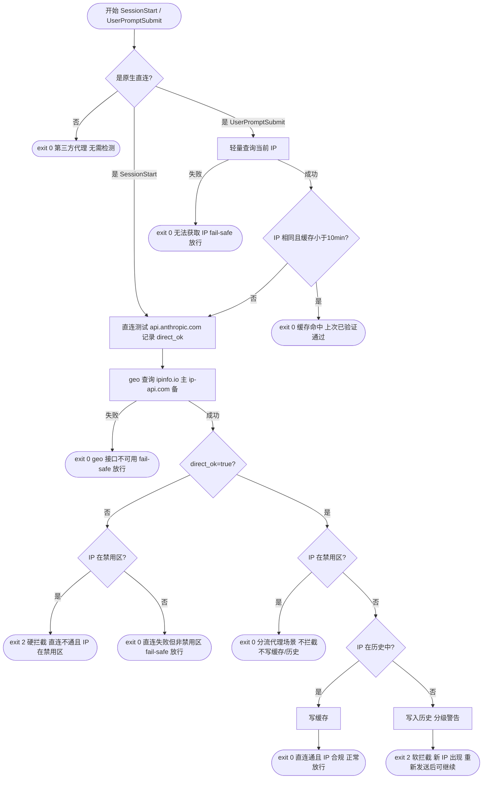

# IP 地理位置访问控制 - 方案设计

## 需求概述

在 Claude Code 使用过程中，通过检测用户当前 IP 的地理位置，若 IP 归属于禁止国家列表，则拦截用户的所有输入任务，阻止其使用 Claude。

---

## 禁止国家列表

基于 [Anthropic 官方支持地区](https://www.anthropic.com/supported-countries) 及美国 OFAC 出口管制规定：

| 国家/地区 | ISO 代码 | 原因 |
|-----------|----------|------|
| 中国大陆 | `CN` | 监管/地缘政治 |
| 俄罗斯 | `RU` | 美国制裁 |
| 朝鲜 | `KP` | OFAC 制裁 |
| 伊朗 | `IR` | OFAC 制裁 |
| 叙利亚 | `SY` | OFAC 制裁 |
| 古巴 | `CU` | OFAC 制裁 |
| 白俄罗斯 | `BY` | 制裁相关 |
| 委内瑞拉 | `VE` | 未列入支持名单 |
| 缅甸 | `MM` | 未列入支持名单 |
| 利比亚 | `LY` | 未列入支持名单 |
| 索马里 | `SO` | 未列入支持名单 |
| 也门 | `YE` | 未列入支持名单 |
| 马里 | `ML` | 未列入支持名单 |
| 中非共和国 | `CF` | 未列入支持名单 |
| 南苏丹 | `SS` | 未列入支持名单 |
| 刚果民主共和国 | `CD` | 未列入支持名单 |
| 厄立特里亚 | `ER` | 未列入支持名单 |
| 阿富汗 | `AF` | 未列入支持名单 |
| 乌克兰 | `UA` | 俄占区受限（克里米亚、顿涅茨克等），脚本无法细分省级，整国拦截 |

> 后续如需扩展，在 `ip-guard-lib.sh` 的 `BLOCKED_COUNTRIES` 变量中追加 ISO 代码即可。

---

## 完整检测流程



---

## 拦截行为

拦截方式：Hook 脚本返回 `exit code 2`，Claude Code 将 stderr 内容展示给用户。共两类拦截：

**硬拦截**（直连不通 + IP 在禁用区）：

```
[访问受限] 检测到您当前的网络 IP（{IP}）位于受限地区（{COUNTRY_CODE}），无法使用 Claude。请切换网络后重试。
```

**软拦截**（直连通 + IP 不在禁用区 + 新 IP 首次出现）：

```
[提示/注意/警告/严重警告] ...（分级提示语）

最近 30 天 IP 使用记录：
  时间                  IP                 完整地址
  --------------------------------------------------------------------------------
  2026-03-21 10:00:01  1.2.3.4            US · Utah · Salt Lake City (EFUsoft LLC)
```

软拦截通过 exit 2 阻止当前 prompt，用户**重新发送即可继续**（第二次发送时该 IP 已在历史中，正常放行）。

**不拦截时**：脚本正常退出（exit 0），用户无感知。

---

## IP 查询接口

使用公共免费接口，无需 API Key。

### 接口验证结果（2026-03-20）

| 接口 | 类型 | 验证结果 | 说明 |
|------|------|----------|------|
| `https://api.ipify.org?format=json` | 轻量（仅 IP） | ✅ 可用 | 返回 `{"ip":"..."}` |
| `https://ipapi.co/json/` | 完整地理 | ❌ 不可用 | 免费版频繁触发 RateLimit |
| `https://ip-api.com/json/`（HTTPS） | 完整地理 | ❌ 不可用 | HTTPS 需付费 key |
| `http://ip-api.com/json/`（HTTP） | 完整地理 | ✅ 可用 | 免费但无 HTTPS，45次/分钟 |
| `https://ipinfo.io/json` | 完整地理 | ✅ 可用 | 支持 HTTPS，返回 `country` 字段 |
| `https://freeipapi.com/api/json` | 完整地理 | ❌ 不稳定 | 响应超时 |

### 最终选型

- **轻量查询**（每次 prompt 获取当前 IP）：`https://api.ipify.org?format=json`
  - 返回字段：`ip`
- **完整地理查询**（IP 变化或超时时触发）：`https://ipinfo.io/json`（主）
  - 返回字段：`ip`、`country`（ISO 代码）、`region`、`city`、`org`
  - Fallback：`http://ip-api.com/json/`，对应字段 `query`、`countryCode`、`regionName`、`city`、`isp`

---

## 缓存机制

- **缓存文件路径**：`~/.cache/claude-ip-guard/ip_cache`
- **文件内容格式**（管道分隔，4 字段）：

  ```
  1742380000|US|Salt Lake City|192.168.1.1
  [Unix时间戳]|[country_code]|[city]|[ip]
  ```

- **写入时机**：仅在 `direct_ok=true` + IP 不在禁用区 + IP 已在历史中（已知 IP）时写入；分流代理场景、硬拦截、软拦截路径均不写缓存
- **缓存命中**：UserPromptSubmit 中 IP 相同且缓存 < 10 分钟时直接放行，跳过所有检测
- **缓存有效期**：10 分钟（600 秒），IP 变化时立即失效
- **异常处理**：任何查询失败均放行（fail-safe），不因网络问题误拦截

---

## 新 IP 出现检测

### 触发条件

仅在 `direct_ok=true` + IP 不在禁用区时执行历史判断：

- **IP 不在历史中**（首次出现）→ 写入历史，展示分级警告（exit 2 软拦截，用户重发后放行）
- **IP 已在历史中**（已知 IP）→ 仅写缓存，放行，不提示

### 历史记录

- 按 IP 去重，同一 IP 只写入一次，保留最近 **30 天**
- 存储位置：`~/.cache/claude-ip-guard/ip_history.jsonl`（每行一条 JSON）
- 记录字段：

  ```json
  {
    "time": "2026-03-21 10:00:01",
    "ip": "192.166.82.233",
    "country": "US",
    "region": "Utah",
    "city": "Salt Lake City",
    "org": "EFUsoft LLC"
  }
  ```

### 提示展示格式

提示内容包含两部分：等级警告语 + 近 30 天 IP 历史表格。

```
[提示] 检测到新的网络 IP（192.166.82.233），请确认网络环境正常。重新发送消息即可继续使用。

最近 30 天 IP 使用记录：
  时间                  IP                 完整地址
  --------------------------------------------------------------------------------
  2026-03-21 10:00:01  192.166.82.233     US · Utah · Salt Lake City (EFUsoft LLC)
  2026-03-19 08:30:00  1.2.3.4            SG · Central · Singapore (Singtel)
```

### 新 IP 数量与提示等级

统计范围：`ip_history.jsonl` 中近 30 天的**去重 IP 数**（写入前统计，+1 后作为展示次数）。

| 近 30 天不同 IP 数 | 等级 | 提示语前缀 |
|-------------------|------|-----------|
| 第 1 个 | 信息 | `[提示]` |
| 第 2～3 个 | 注意 | `[注意]` |
| 第 4～6 个 | 警告 | `[警告]` |
| 第 7 个及以上 | 严重 | `[严重警告]` |

> 软拦截通过 exit 2 触发，当前 prompt 不会被 Claude 处理；用户**重新发送**后该 IP 已在历史中，正常放行。

---

## 文件结构

```
claude-ip-guard/
├── install.sh                     # 安装脚本（复制到目标项目）
├── doc/
│   └── ip-access-control-design.md
└── .claude/
    ├── settings.json              # Hook 配置（团队共享，提交至仓库）
    └── scripts/
        ├── ip-guard-lib.sh        # 共享库：查询、缓存、历史、拦截逻辑
        ├── check-ip-on-start.sh   # SessionStart hook：每次会话必检
        └── check-ip-on-prompt.sh  # UserPromptSubmit hook：轻量比对 + 按需重检
```

**运行时缓存目录**（本地，不提交）：

```
~/.cache/claude-ip-guard/
├── ip_cache                   # 当前 IP 缓存（timestamp|country|city|ip）
├── ip_history.jsonl           # IP 变化历史（最近 30 天，JSONL 格式）
├── ip-guard-2026-03-20.log    # 当日运行日志（按天分割）
└── ...
```

---

## Hook 配置

**团队共享**，配置写入项目根目录 `.claude/settings.json`，所有拉取该仓库的成员自动生效：

```json
{
  "hooks": {
    "SessionStart": [
      {
        "matcher": "startup",
        "hooks": [
          {
            "type": "command",
            "command": "bash .claude/scripts/check-ip-on-start.sh",
            "timeout": 15
          }
        ]
      }
    ],
    "UserPromptSubmit": [
      {
        "hooks": [
          {
            "type": "command",
            "command": "bash .claude/scripts/check-ip-on-prompt.sh",
            "timeout": 15
          }
        ]
      }
    ]
  }
}
```

> 成员可在 `.claude/settings.local.json` 中覆盖配置（不提交至仓库）。

---

## 安装方式

```bash
# 克隆 claude-ip-guard
git clone https://github.com/your-org/claude-ip-guard.git
```

### 项目级安装（仅对当前项目生效）

```bash
# 安装到指定项目
bash claude-ip-guard/install.sh /path/to/your-project

# 安装到当前目录
bash claude-ip-guard/install.sh
```

脚本写入 `.claude/scripts/`，Hook 命令使用相对路径 `bash .claude/scripts/check-ip-on-start.sh`。

### 全局安装（对所有项目生效）

```bash
bash claude-ip-guard/install.sh --global
```

脚本写入 `~/.claude/scripts/`，Hook 命令使用绝对路径 `bash ~/.claude/scripts/check-ip-on-start.sh`，无需在每个项目中重复安装。

---

`install.sh` 会：
1. 复制三个脚本（`ip-guard-lib.sh` / `check-ip-on-start.sh` / `check-ip-on-prompt.sh`）到目标 `.claude/scripts/`
2. 按安装模式生成对应路径的 Hook 配置
3. 若目标 `settings.json` 不存在，自动创建；若已存在，用 python3 自动合并 hooks（保留原有配置不变，相同命令不重复写入）
4. 重启 Claude Code 后生效

---

## 风险与注意事项

| 风险 | 应对策略 |
|------|---------|
| 直连测试超时影响体验 | 设置 5s connect-timeout，最坏等待 5s 后进入 geo 查询 |
| IP 接口超时/不可用 | 设置 5s 超时，失败时 fail-safe 放行，避免误拦截 |
| 用户配置了第三方代理但仍是原生地址 | 前置判断仅跳过明确非 Anthropic 的地址，原生地址仍受保护 |
| 缓存文件损坏 | 时间戳格式校验，异常时强制重走完整流程 |
| SessionStart exit 2 不可见 | SessionStart 负责写缓存；PROMPT hook 负责可见拦截（用户发第一条消息时生效） |
| 脚本权限问题 | `install.sh` 自动执行 `chmod +x`，手动安装需确保有执行权限 |
| 团队成员本地覆盖 | 可在 `settings.local.json` 中覆盖（该文件不提交仓库） |
| Windows 兼容性 | 脚本依赖 bash + python3，支持 macOS / Linux / WSL / Git Bash；纯 Windows CMD 不支持 |

---

## 实现清单

- [x] `ip-guard-lib.sh` 共享库（前置判断、直连测试、查询、缓存、历史、拦截）
- [x] `check-ip-on-start.sh` SessionStart hook
- [x] `check-ip-on-prompt.sh` UserPromptSubmit hook
- [x] `.claude/settings.json` Hook 配置
- [x] `install.sh` 安装脚本
- [x] 按天分割日志（`~/.cache/claude-ip-guard/ip-guard-YYYY-MM-DD.log`）
- [x] 代理感知：`ANTHROPIC_BASE_URL` 非原生时跳过全部检测
- [x] 直连测试：`api.anthropic.com` 可达性检测，记录 `direct_ok`
- [x] Geo 查询始终执行（`direct_ok` 决定后续策略）
- [x] 硬拦截：`direct_ok=false` + IP 在禁用区
- [x] 分流代理场景：`direct_ok=true` + IP 在禁用区，放行但不写缓存/历史
- [x] 新 IP 软拦截：`direct_ok=true` + IP 不在禁用区 + 首次出现
- [x] 缓存仅在已知 IP 路径写入
- [x] IP 历史按 IP 去重，仅新 IP 写入，30 天保留（原子写入）
- [x] 去重计数：`count_recent_ips` 统计唯一 IP 数，防多进程竞态
- [x] 分级提示语（第 1 / 2-3 / 4-6 / 7+ 个 IP）
- [x] 历史记录表格格式化展示
- [x] IPv4 / IPv6 双栈 IP 格式校验