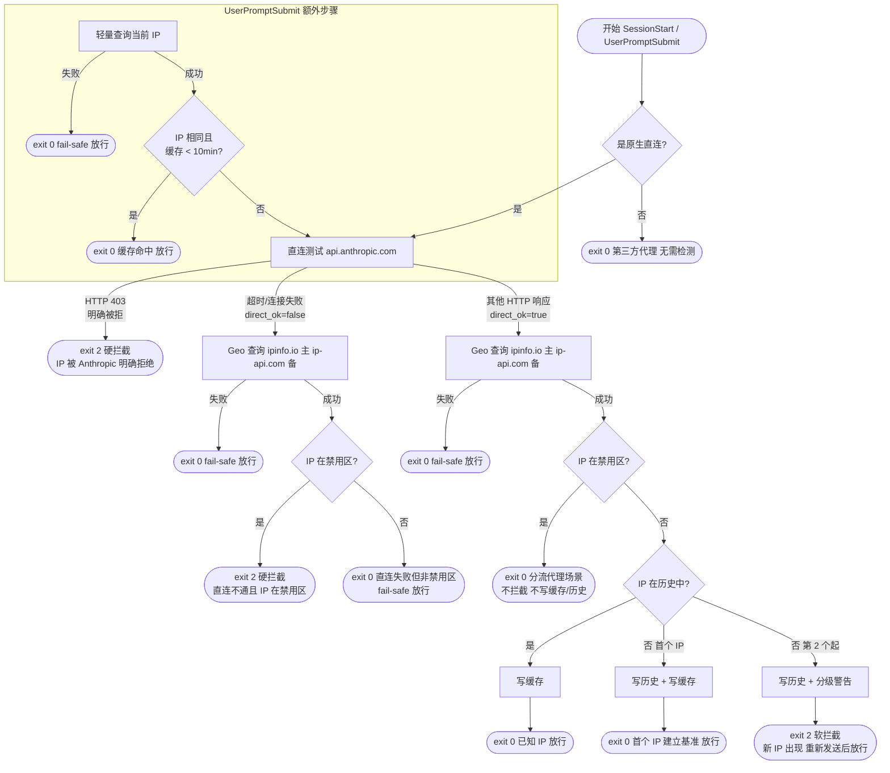

# IP 地理位置访问控制 - 方案设计

## 需求概述

在 Claude Code 使用过程中，通过检测用户当前 IP 的地理位置，若 IP 归属于禁止国家列表，则拦截用户的所有输入任务，阻止其使用 Claude。

---

## 禁止国家列表

基于 [Anthropic 官方支持地区](https://www.anthropic.com/supported-countries) 及美国 OFAC 出口管制规定：

| 国家/地区 | ISO 代码 | 原因 |
|-----------|----------|------|
| 中国大陆 | `CN` | 监管/地缘政治 |
| 俄罗斯 | `RU` | 美国制裁 |
| 朝鲜 | `KP` | OFAC 制裁 |
| 伊朗 | `IR` | OFAC 制裁 |
| 叙利亚 | `SY` | OFAC 制裁 |
| 古巴 | `CU` | OFAC 制裁 |
| 白俄罗斯 | `BY` | 制裁相关 |
| 委内瑞拉 | `VE` | 未列入支持名单 |
| 缅甸 | `MM` | 未列入支持名单 |
| 利比亚 | `LY` | 未列入支持名单 |
| 索马里 | `SO` | 未列入支持名单 |
| 也门 | `YE` | 未列入支持名单 |
| 马里 | `ML` | 未列入支持名单 |
| 中非共和国 | `CF` | 未列入支持名单 |
| 南苏丹 | `SS` | 未列入支持名单 |
| 刚果民主共和国 | `CD` | 未列入支持名单 |
| 厄立特里亚 | `ER` | 未列入支持名单 |
| 阿富汗 | `AF` | 未列入支持名单 |
| 乌克兰 | `UA` | 俄占区受限（克里米亚、顿涅茨克等），因无法细分省级，整国拦截 |

> 如需扩展，在 `ip-guard-lib.sh` 的 `BLOCKED_COUNTRIES` 变量中追加 ISO 代码即可。

---

## 完整检测流程



> **注意**：HTTP 403 硬拦截仅在 `SessionStart` 中实现（在 geo 查询前提前返回）。`UserPromptSubmit` 中 403 被视为 `direct_ok=false`，走正常地理位置判断流程。

---

## 直连测试逻辑

`test_direct` 向 `https://api.anthropic.com/v1/messages` 发送带 dummy key 的 POST 请求，根据 HTTP 状态码判断：

| 返回状态 | 含义 | exit code |
|----------|------|-----------|
| 任意 HTTP 响应（含 401/4xx/5xx，**除 403**） | 链路可达 | 0（direct_ok=true） |
| HTTP 403 | 明确被 WAF/区域封锁拒绝 | 2 |
| 000 / 空（连接超时或拒绝） | 链路不可达 | 1（direct_ok=false） |

---

## 拦截行为

拦截方式：Hook 脚本返回 `exit code 2`，Claude Code 将 stderr 内容展示给用户。共两类拦截：

**硬拦截 — IP 被明确拒绝（SessionStart 专属）**：

```
[访问受限] 检测到当前 IP 被 Anthropic 明确拒绝（HTTP 403），无法使用 Claude。请切换网络后重试。
```

**硬拦截 — 受限国家（直连不通 + IP 在禁用区）**：

```
[访问受限] 检测到您当前的网络 IP（{IP}）位于受限地区（{COUNTRY_CODE}），无法使用 Claude。请切换网络后重试。
```

**软拦截**（直连通 + IP 合规 + 第 2 个及以上新 IP）：

```
[提示/注意/警告/严重警告] ...（分级提示语）

最近 30 天 IP 使用记录：
  时间                  IP                 完整地址
  --------------------------------------------------------------------------------
  2026-03-21 10:00:01  1.2.3.4            US · Utah · Salt Lake City (EFUsoft LLC)
```

软拦截通过 exit 2 阻止当前 prompt，用户**重新发送即可继续**（第二次发送时该 IP 已在历史中，正常放行）。

**不拦截时**：脚本正常退出（exit 0），用户无感知。

---

## IP 查询接口

使用公共免费接口，无需 API Key。

### 接口验证结果（2026-03-20）

| 接口 | 类型 | 验证结果 | 说明 |
|------|------|----------|------|
| `https://api.ipify.org?format=json` | 轻量（仅 IP） | ✅ 可用 | 返回 `{"ip":"..."}` |
| `https://ipapi.co/json/` | 完整地理 | ❌ 不可用 | 免费版频繁触发 RateLimit |
| `https://ip-api.com/json/`（HTTPS） | 完整地理 | ❌ 不可用 | HTTPS 需付费 key |
| `http://ip-api.com/json/`（HTTP） | 完整地理 | ✅ 可用 | 免费但无 HTTPS，45次/分钟 |
| `https://ipinfo.io/json` | 完整地理 | ✅ 可用 | 支持 HTTPS，返回 `country` 字段 |
| `https://freeipapi.com/api/json` | 完整地理 | ❌ 不稳定 | 响应超时 |

### 最终选型

- **轻量查询**（UserPromptSubmit 缓存比对）：`https://api.ipify.org?format=json`
- **完整地理查询**（IP 变化或缓存过期时）：`https://ipinfo.io/json`（主），`http://ip-api.com/json/`（备）

---

## 缓存机制

- **缓存文件**：`~/.cache/claude-ip-guard/ip_cache`
- **格式**（管道分隔，4 字段）：`[Unix时间戳]|[country_code]|[city]|[ip]`
- **写入时机**：`direct_ok=true` + IP 不在禁用区 + IP 已在历史（或为首个 IP）时写入；分流代理场景、硬拦截、软拦截路径均不写缓存
- **缓存命中条件**：IP 相同 且 缓存时间 < 10 分钟，命中时直接放行，跳过所有检测
- **失效条件**：IP 变化时立即失效；缓存时间戳异常时强制重检

---

## 新 IP 出现检测

### 触发条件

仅在 `direct_ok=true` + IP 不在禁用区时执行历史判断：

| 情况 | 行为 |
|------|------|
| IP 不在历史 + 为首个 IP | 写历史 + 写缓存，直接放行（建立基准，不提醒） |
| IP 不在历史 + 第 2 个起 | 写历史，exit 2 软拦截 + 分级警告 |
| IP 已在历史 | 仅写缓存，exit 0 放行 |

### 历史记录

- 按 IP 去重，同一 IP 只写入一次，保留最近 **30 天**
- 存储位置：`~/.cache/claude-ip-guard/ip_history.jsonl`（每行一条 JSON）
- 记录字段：`time`、`ip`、`country`、`region`、`city`、`org`

### 新 IP 数量与提示等级

统计范围：`ip_history.jsonl` 中去重后的 IP 总数（写入后统计）。

| 近 30 天不同 IP 数 | 等级 | 提示语前缀 |
|-------------------|------|-----------|
| 第 1 个 | — | 直接放行，不提示 |
| 第 2～3 个 | 注意 | `[注意]` |
| 第 4～6 个 | 警告 | `[警告]` |
| 第 7 个及以上 | 严重 | `[严重警告]` |

---

## 文件结构

```
claude-ip-guard/
├── install.sh                     # 安装脚本
├── doc/
│   └── ip-access-control-design.md
└── .claude/
    ├── settings.json              # Hook 配置（团队共享，提交至仓库）
    └── scripts/
        ├── ip-guard-lib.sh        # 共享库：查询、缓存、历史、拦截逻辑
        ├── check-ip-on-start.sh   # SessionStart hook
        └── check-ip-on-prompt.sh  # UserPromptSubmit hook
```

**运行时缓存目录**（本地，不提交）：

```
~/.cache/claude-ip-guard/
├── ip_cache                   # 当前 IP 缓存（timestamp|country|city|ip）
├── ip_history.jsonl           # IP 变化历史（最近 30 天，JSONL 格式）
└── ip-guard-YYYY-MM-DD.log    # 当日运行日志（按天分割）
```

---

## 风险与注意事项

| 风险 | 应对策略 |
|------|---------|
| 直连测试超时影响体验 | 设置 5s connect-timeout，超时后进入 geo 查询 |
| IP 接口超时/不可用 | 设置 5s 超时，失败时 fail-safe 放行 |
| 缓存文件损坏 | 时间戳格式校验，异常时强制重走完整流程 |
| SessionStart exit 2 不可见 | UserPromptSubmit 负责可见拦截（用户发第一条消息时生效） |
| 脚本权限问题 | `install.sh` 自动执行 `chmod +x` |
| 团队成员本地覆盖 | 可在 `settings.local.json` 中覆盖（该文件不提交仓库） |
| Windows 兼容性 | 支持 macOS / Linux / WSL / Git Bash；纯 Windows CMD 不支持 |
| 多进程竞态 | `count_recent_ips` 对 IP 去重计数；历史文件原子写入（tmp → replace） |